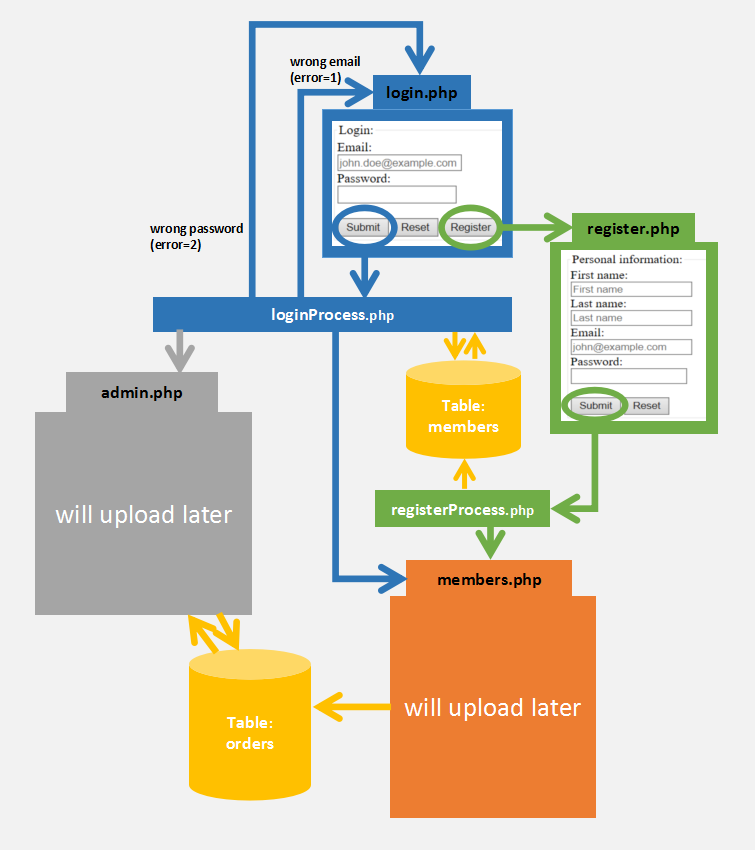

# A website for a Milk-Tea Store

## Develop enviroment of this project:

* `windows10`

* `PHP`：http://windows.php.net/download/  Php5.6.30 (VC11 x64 Thread Safe) (The VC11 builds require to have the Visual C++ Redistributable for Visual Studio 2012 x86 or x64 installed)

* `Apache`:  https://www.apachelounge.com/download/  Apache 2.4.25 Win64

* `MySQL`:  https://dev.mysql.com/downloads/mysql/  MySQL Community Server 5.7.18

There is a video on youtube demonstrating how to install them:https://www.youtube.com/watch?v=kuMTZowwjus
http://github.com - automatic!
[GitHub](http://github.com)

## Architecture of this project:

